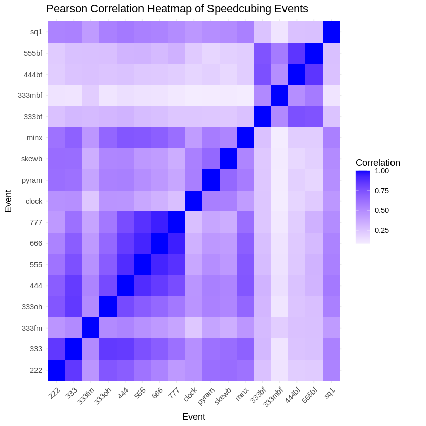

# Speedcubing Event Performance & Correlation Analysis
**Author:** Alexandra McKillip  
**Date:** December 2025  
**Methodology:** Pearson Correlation, Matrix Completion (SoftImpute), PCA  
**Data Source:** [World Cube Association (WCA) Results Export](https://www.worldcubeassociation.org/export/results)

## Project Overview
While the 3x3x3 Rubik’s Cube is the most iconic puzzle, the World Cube Association (WCA) recognizes 17 official competitive events. These range from classic cubes (2x2x2 to 7x7x7) to specialized formats like Blindfolded and Fewest Moves, and non-cubic puzzles like Square-1 and Megaminx.

By analyzing official WCA results from 2020–2025, this study identifies clusters of highly correlated events and utilizes low-rank matrix completion to predict a competitor's performance in events they have never attempted.

## Key Findings

### 1. Skill Clusters
The analysis revealed an average global correlation of **0.47** across all events, suggesting a strong shared underlying skill (general speedcubing ability). Key clusters identified include:

* **The Big Cube Cluster (4x4–7x7):** Extremely high inter-correlations ($r \approx 0.77–0.94$), reflecting shared demands for pattern recognition and high-speed dexterity.
* **The Memory Cluster:** Blindfolded events (3x3, 4x4, 5x5) correlate highly with each other ($r \approx 0.74–0.87$) but show weaker links to speed-based events.
* **Specialized Events:** 3x3x3 Multi-Blind and Fewest Moves represent the most distinct "specialties," requiring unique cognitive approaches.

### 2. Matrix Completion & Predictive Modeling
Using the `softImpute` package in R, I performed low-rank matrix completion to fill the "sparse" gaps in the competitor-event matrix (as most cubers do not compete in every event). 

* **Validation:** Through an 80/20 train-test split, the model achieved an $RMSE = 0.718$ at the optimal rank, indicating high predictive accuracy for unobserved performances.

## Setup and Usage
1.  **Download Data:** Download the Results and Competition exports in TSV format from the [WCA Export Page](https://www.worldcubeassociation.org/export/results).
2.  **Environment:** Ensure `tidyverse` and `softImpute` are installed in your R environment.
3.  **Run:** Execute `performance_analysis.R`. The script will automatically clean the data, calculate correlations, and generate the predicted performance matrix.
